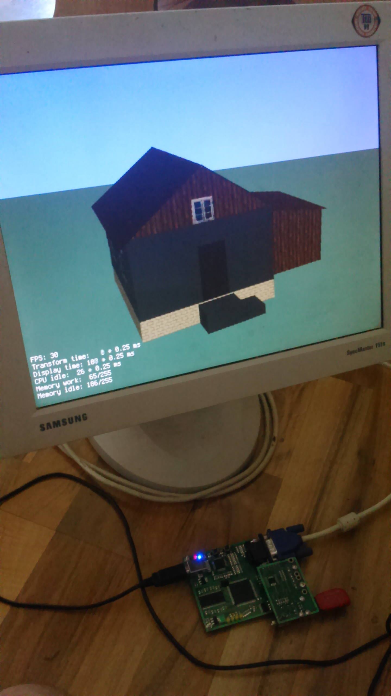
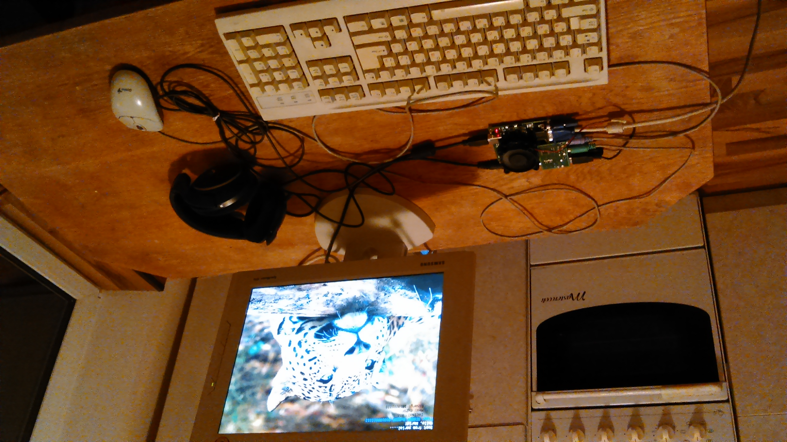

# miksys

MIKSYS is an FPGA project for the [Marsohod2](http://marsohod.org/howtostart/prodmarsohod2) development board with Cyclone III.
It is an education project only and has no practical use.

The idea was:
1. To develop all components from scratch without any third-party IP blocks.
2. To get maximal performance from the development board and illustrate it by realtime 3D graphics.

The development board contains:
* Cyclone III EP3C10E144C8 (10320 logic blocks, 414Kbit memory)
* Micron 64Mbit SDRAM 4x1Mx16bit (max frequency 134MHz)
* Various I/O ports

The following IP blocks were developed:
* CPU with original architecture and command system
* SDRAM controller
* VGA controller
* PS/2 controller
* UART controller
* USB1.1 host controller

Also the project contains:
* Assembler
* C compiler based on LCC
* MIKSYS Simulator

The project is finished and no further work is planned on it.

[Documentation (in russian)](./doc/miksys.md)

